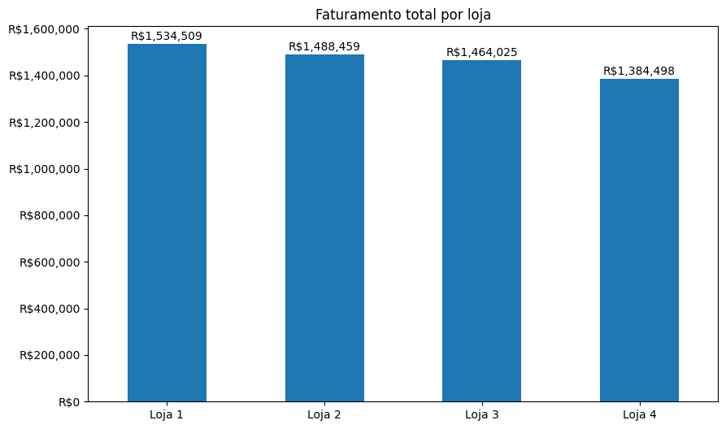
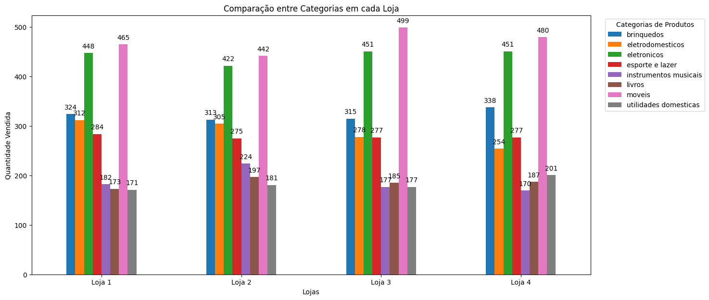
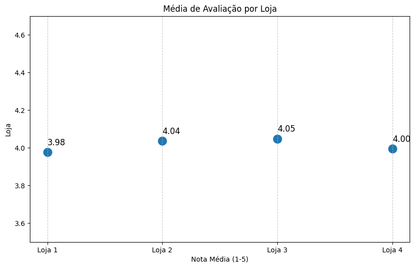

# Challenge Alura Store

  
  
  
  
  

Projeto realizado através do curso G9 ONE (Oracle Next Education), da Oracle em parceria com a Alura.

Consiste em uma análise de dados sobre 4 lojas da rede de comércio fictícia Alura Store, com o objetivo de auxiliar na decisão de qual das 4 lojas o proprietário deveria vender, com o objetivo de iniciar um novo empreendimento.

## Visualização do Projeto

O arquivo principal do projeto é um Jupyter Notebook (.ipynb). O Github permite visualização estática desse tipo de arquivo de forma nativa, basta clicar no arquivo [AluraStoreBrasil.ipynb](AluraStoreBrasil.ipynb) (ou neste link), que o Github renderizará o Notebook, onde você poderá visualizar o código, as células de análise e os gráficos.

Também é possível abrir o arquivo em alguma IDE para interagir ou manipular o código e os dados. Recomendo a utilização do Google Colab. Basta acessar este [Link](https://colab.research.google.com/drive/1ylX1v_7udMSAzHh9QHq5TcqwI7cRlUJh#scrollTo=RhEdWd9YUR6H), que o projeto será aberto no Colab. Para garantir que não ocorra nenhum problema, clique "Conectar" no canto superior direito, e então execute cada célula.

## Visualização de Dados

### Faturamento

Embora a diferença do faturamento entre as lojas seja majoritariamente bem sutil, é notável a diferença entre a Loja 1 e a Loja 4: a Loja 4 está R$150,011 atrás, sendo de longe a menos lucrativa entre as 4. 

---

### Frete médio

A Loja 1, embora tenha o maior faturamento, tem também a média de frete mais alta. A diferença entre as Lojas 2 e 3, como no faturamento, é bem sutil, e a média de frete da Loja 4 é notavelmente mais baixa que **as** demais.

---

### Comparação das categorias mais vendidas entre cada loja

Em todas as lojas, as categorias mais compradas, são de longe Móveis e Eletrônicos. A Loja 2 tem o maior equilíbrio entre todas as categorias, e teve o "chão" de consumo mais baixo: sua categoria menos vendida teve uma quantidade de vendas comparável com a quantidade de vendas da segunda/terceira categoria menos vendida das demais.

#### Total de vendas de cada loja:
* Volume Loja 1: 2.359 itens
* Volume Loja 2: 2.359 itens
* Volume Loja 3: 2.358 itens
* Volume Loja 4: 2.359 itens

---

### Média de avaliações

 

A Loja 1, que tem a média de frete mais alta, tem também a avaliação mais baixa entre todas as lojas, com a Loja 4 logo acima. Novamente vemos bastante equilíbrio entre as Lojas 2 e 3.

## Relatório Final

As Lojas 2 e 3 são o padrão de ouro: avaliações decentes, frete moderado e bom faturamento. Há muito equilíbrio entre as duas, o que nos deixa com as Lojas 1 e 4: A Loja 1, embora tenha o maior faturamento, acaba sendo a loja mais "instável", com a menor avaliação (abaixo de 4 estrelas) e de longe a maior média de frete. Já a Loja 4, embora tenha o menor faturamento, é definitivamente mais estável, possuindo o menor valor de frete e uma avaliação decente.

Minha sugestão seria vender a Loja 1, que é a mais instável, e realizar pesquisas mais a fundo acerca da situação da Loja 4, e baseado em seus resultados, aplicar as estratégias de marketing e venda corretas à Loja 4, que tem o potencial de se aproximar ou até mesmo superar as demais.
